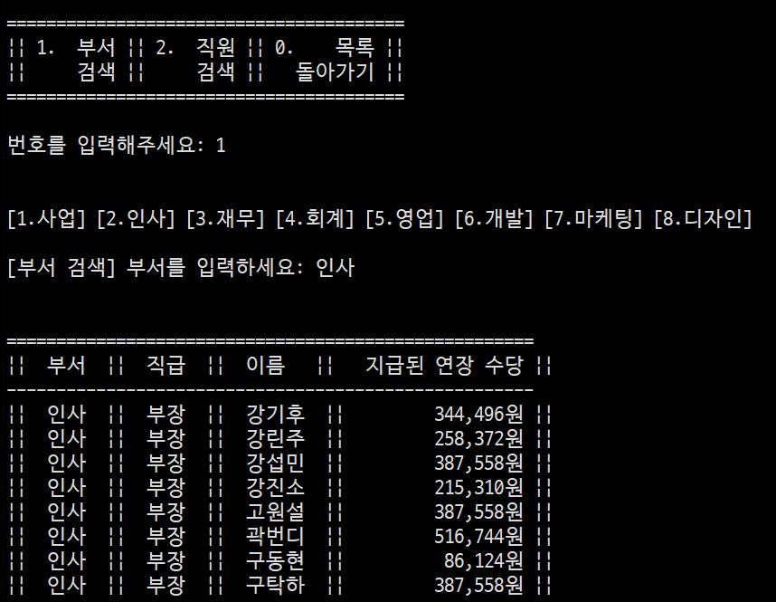
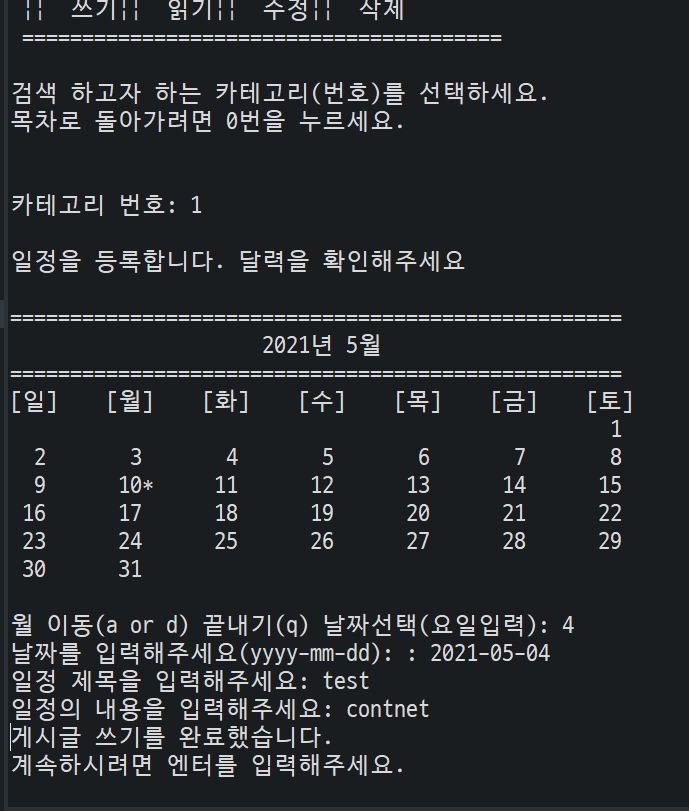
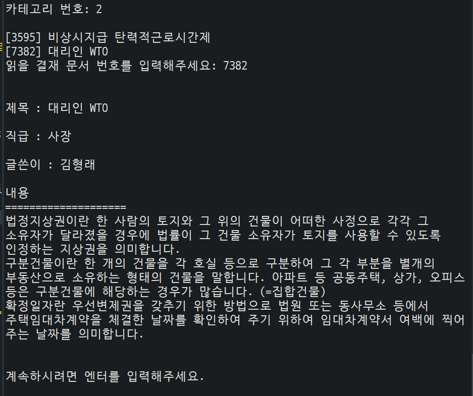

# 그룹웨어
## SIST Java console Project

그룹웨어를 통한 업무공유, 전자문서, 사내 이메일 등을 통해서 업무 시간을 단축하고, 경제적으로 업무를 진행하기 위해 제작한 프로그램. 인사 관리에 필요한 요구사항을 구현하기 위하여 직급과 부서를 나누고, 분산된 업무를 하나로 관리할 수 있는 통합 프로그램이다.

- 종이 문서가 없는 사무실 구현에 필요한 다양한 기능을 제공하여, 구축 시 최대한의 효율을 얻는 것을 목표로 개발한다. 시중의 일반적인 그룹웨어는 메신저를 통해 단순 의사소통을 지원하는 경우가 대부분이어서 활용도가 떨어진다. 그룹웨어를 도입한 기업들이 그룹웨어의 활용성에 회의적이라는 기사를 확인하고, 활용도를 높이기 위해 최대한 많은 기능을 구현하였다. 협업 업무가 가능하다는 그룹웨어의 가장 큰 장점을 살려서 그룹웨어 시스템을 구축하는 것을 목표로 한다.
- 5명 구성원 1개월 작업.

## Features
1. 메일
이메일의 읽기, 쓰기, 검색, 수정, 스팸확인 기능
2. 메신저
메신저의 읽기, 쓰기, 삭제, 수정 기능
3. 주소록
주소록을 통한 검색 및 추가, 삭제 기능
1. 전자결재
전자결재의 읽기, 쓰기, 삭제, 수정, 기능
1. 게시판
게시글의 읽기, 쓰기, 삭제, 수정 기능
1. 일정관리 
일정의 읽기, 쓰기, 삭제, 수정 기능
2. 휴가관리
휴가 신청, 취소 및 신청 내역 확인 기능 
3. 예약 /대여
회의실 예약, 예약 취소, 예약 현황 확인 기능
차량 재고 관리를 바탕으로 차량 예약 등록, 확인, 삭제 기능 
4. 교육 센터
교육 일정 신청, 조회, 수정, 삭제 기능 
1. 근태관리
출근 및 퇴근 등록, 본인의 월간 근무시간 조회, 직원 별 월간 근무시간 조회
2. 인사관리
권한 있는 사용자가 직원들의 부서, 직급을 변경하거나, 신입사원, 퇴사직원 관리, 고과 데이터를 관리하는 기능
3. 수당관리
로그인한 유저의 성과급, 연장근무 수당 조회 기능
권한 있는 사용자의 부서별/직원 별 연장근무 수당, 성과급, 월급 검색 조회 기능

## Tech

- Java
    - 파일 입출력
    BufferedReader, Writer(new FileReader, Writer( "path" )
    컬렉션
    ArrayList<T>, LinkedList<T>, HashMap<T>, Comparator 등
    오버로딩, 오버라이딩
    생성자 오버로딩, 객체에 속한 ArrayList 함수 오버로딩, 비교 연산을 위한 오버로딩, Calendar 출력을 위한 오버라이딩
    기타 레퍼런스 타입 클래스 
        1. 데이터를 생성하기 위한 Random, Math클래스
        2.  일정 조작을 위한 Calendar 클래스를 이용

    

## Review

쌍용교육센터 java 과정 이후 첫번재 프로젝트였다.
데이터의 양이 많고, 사무적인 주제인 그룹웨어를 택했다.
팀원들과 협업하여 수업때 배운 내용을 모두 활용하는것을 목포료 삼았고
실제로 여러 업무에 필요한 기술들은 수업 시간때 배운 내용이였다.
기능에 필요한 Class를 생성하고, getter,setter메소드를 통해 자료를 처리하는 방법도 있었고, 
LinkedList<String[]> 자료형을 통해 LinkedList에 속한 자료의 배열을 참고하여 자료를 처리하는 효율적인 방법도 있었다.
제네릭을 좀더 심도있게 활용할 수 있는 기회였다.
모듈간의 결합도를 줄이기 위하여 리팩토링도 하고 각 객체간의 기능을 추상화 하는 과정도 거쳤다.
예외처리로 잘못된 값을 처리하는 과정과 더미 데이터를 만들기 위해 공공데이터 포털의 자료를 이용하여 의미가 있는것 같은 Lorem ipsum을 구현하였다.
더미데이터도 한 파일에 3만줄 이상 만들어서 프로그램의 덩치를 조금이나마 키웠고
최대한 클린한 코드를 만들기 위해서 노력하였으며 변수 네이밍과 주석에도 신경을 썼다.
JavaDoc을 만드는 방법을 배워 JavaDoc도 만들어 볼 수 있는 좋은 기회의 프로젝트였다.

## Result

## License

MIT
